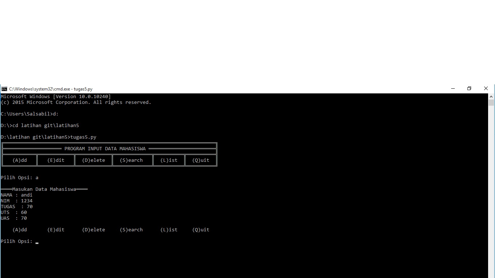
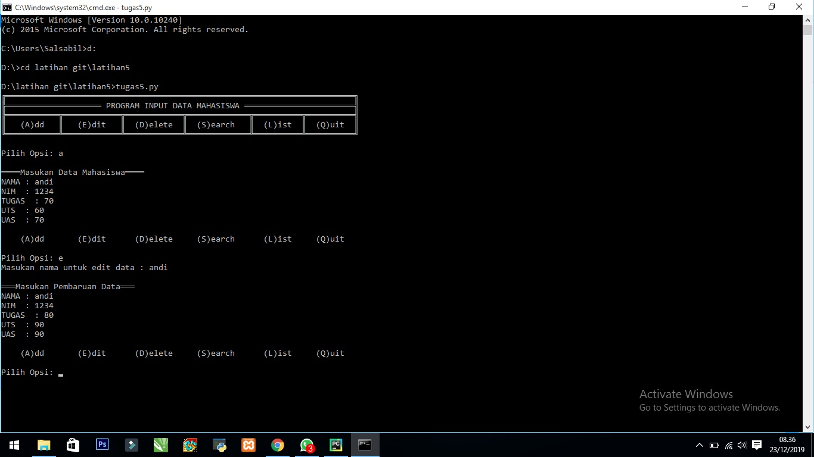
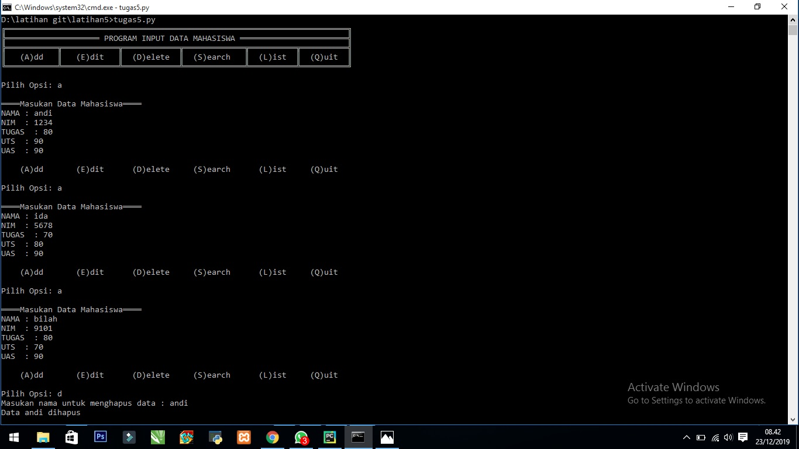
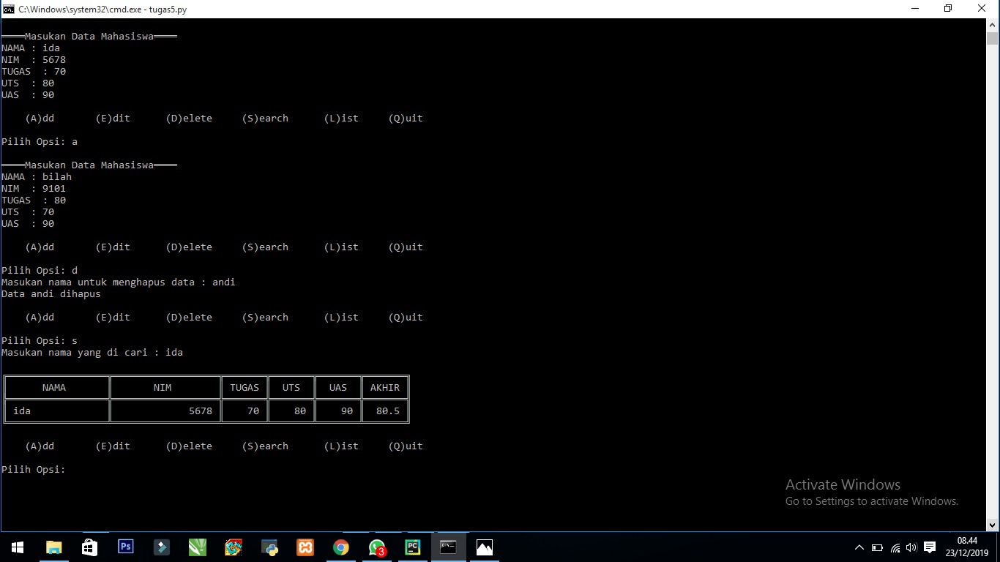
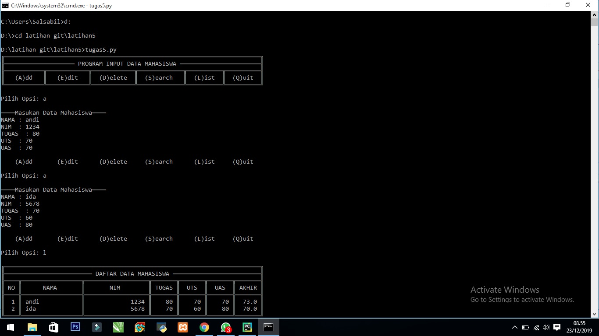

						.:Penjelasan Program 5:.

 1.Input untuk pilih opsi 
(A)dd (E)dit (D)elete (S)earch (L)ist (Q)uit 

 2.Jika Input A
 
	2.1 Input nama,nim,tugas,uts,uas
	
	2.2 Nilai akhir perpaduan nilai tugas,uts,uas
	
	2.3 Jika nilai nim,tugas,uts,uas, kosong/tidak di isi dengan angka maka ValueError dan meminta input ulang
	
	2.4 semua data akan di tambahkan menjadi value dan key menggunakan nama
Tampilan hasil

3.Jika Input E

	3.1 Input nama/key yg di cari
	
	3.2 Jika nama ada di data.keys ?4.2.1 Input pembaruan data
	
	3.2.2 Jika nilai nim,tugas,uts,uas, kosong/tidak di isi dengan angka maka ValueError dan meminta input ulang
	
	3.2.3 Input akan menimpa data yang lama

	3.3 Jika tidak 
	
		3.3.1 Data tidak di temukan
Tampilan hasil

4.Jika Input D

	4.1 Input nama/key yg di cari
	
	4.2 Jika nama ada di data.keys ?
	
	4.2.1 Maka datanya akan di hapus

	4.3 Jika tidak 
	
		4.3.1 Data tidak di temukan
Tampilan hasil

5.Jika Input S

	5.1 Input nama/key yg di cari
	
	5.2 Jika nama ada di data.keys ?6.2.1 Print nama,nim,uts,tugas,akhir

	5.3 
		5.3.1 Data tidak di temukan
		
Tampilan hasil

6.Jika Input L

	6.1 Print data.values / memanggil semua values

Tampilan hasil

7.Jika Input Q

	7.1 Program Berhenti
	
Tampilan hasil

8.Jika Input diluar, A,E,D,S,L,Q

	8.1 Pilih opsi yang tersedia
